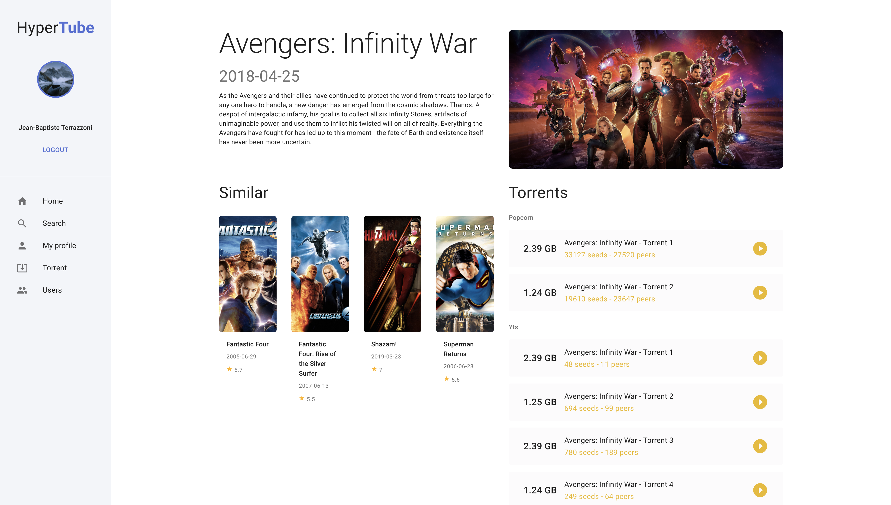
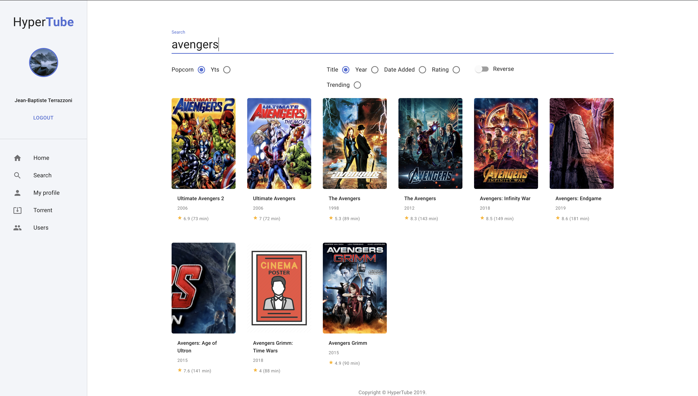
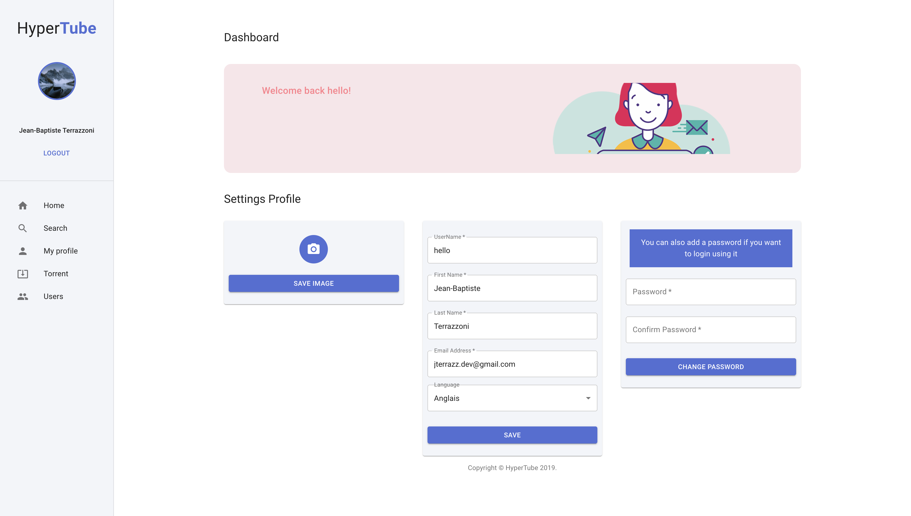

> Hey there, app enthusiasts! 👋 Ready to dive into the world of game-changing apps? At [jterrazz.com](https://jterrazz.com), I'm all about crafting useful applications and sharing the journey! Discover coding insights, self-improvement hacks, and sneak peeks of my latest projects (psst... my next app is all about leveling up in life! 🚀). Come along for the ride - you might just find the spark for your next big idea! 💡💻

# 42-hypertube

A web application to explore, search and play videos of torrent providers. Videos are downloaded on the backend using the BitTorrent protocol and streamed to the browser. The front-end features a beautiful discovery page and social features such as comments.

⚠️ *Disclaimer: This application was made for learning purposes at the 42 Paris School. For legal reasons, this shouldn't be used in the real world.*

*Learn more about how this project workd with the [wiki](https://github.com/jterrazz/42-hypertube/wiki)*

## Starting guide

### Requirements

- Docker `>2.0`

### Start services

Replace the environment variables inside the `docker-compose.yml` file.

```bash
docker-compose up # Start all services
```

The web app is listening on `localhost:4242`. The API is accessible on `localhost:3000`.

## Development

### Start each services independently

#### Database

Start a mongodb process in the background

```bash
docker-compose up -d db_mongo
```

#### Web app

In development mode, the app is served using **hot reload** (A change in the code source automatically reload the app).

```bash
# Requires NodeJS >=12
yarn # Install dependencies
yarn dev
```

The app is available by default on `http://localhost:4242/`

#### API

##### Setup

The API service requires environment variables. You can either pass them as usual **process** environment variables or create a `.env` file in the `server`.

```dotnet
MONGO_URL: mongodb://localhost/hypertube
SERVER_PORT: 3000
API_URL: http://localhost:3000
CLIENT_URL: http://localhost:4242
CAPTCHA_KEY: XXXXX
API_NODE_MAILER_KEY: XXXXX
API_NODE_MAILER_DOMAIN: XXXXX
API_THE_MOVIE_DB_KEY: XXXXX
API_YTS_KEY: XXXXX
API_GOOGLE_CONSUMER_KEY: XXXXX
API_GOOGLE_CONSUMER_SECRET: XXXXX
API_FACEBOOK_APP_ID: XXXXX
API_FACEBOOK_APP_SECRET: XXXXX
API_FORTYTWO_APP_ID: XXXXX
API_FORTYTWO_APP_SECRET: XXXXX
API_GITHUB_CLIENT_ID: XXXXX
API_GITHUB_CLIENT_SECRET: XXXXX
```

##### Start

```bash
# Requires NodeJS >= 12 and yarn
yarn # Installs dependencies
yarn dev # Hot reloaded API
yarn lint # Lint code
yarn reset # Clean all temporary files
```

## Implementation

### Backend

The **API** service provides all the data needed by the web client. It provides endpoints for searching and hot lists of movies, user informations and authentication, video streaming endpoint, etc. Most of the endpoints requires authentication. Authentication must be set on the cookies (see passport.js documentation).

It uses `NodeJS` with the framework `koa` and `typescript`. The data is persisted by `MongoDB`.

[Auto generated API documentation](https://documenter.getpostman.com/view/9049212/SVtVV8SF?version=latest#intro)

### Frontend

The web client is served with SSR (server side rendering) with the `NextJS` framework (`ReactJS` with SSR).

### Bonus

On top of the required project, we did:

- Github authentication
- Custom `magnet-link` player
- A RESTFUL API
- NextJS Server side rendering + ReactJS: Fast first html downloading / page rendering, + web app in the browser
- Captcha for registration
- Docker: one line start
- Real email domain name

## Credits 👩‍💻

- @abbensid - Frontend
- @jterrazz - Backend 

## Screens









